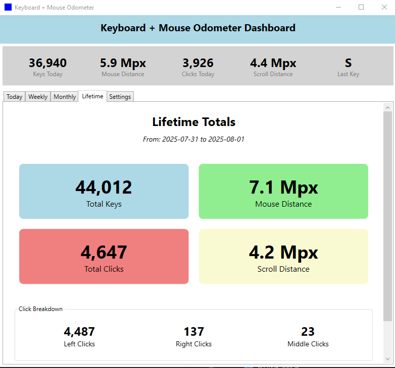
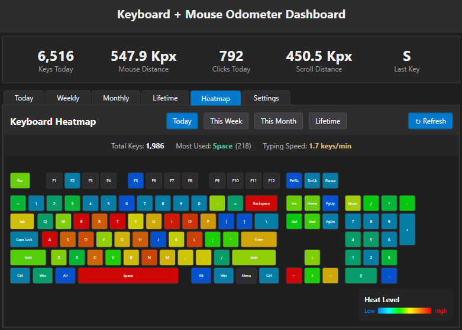

# Keyboard + Mouse Odometer

A Windows desktop application that tracks your keyboard and mouse usage statistics, providing insights into your daily computer usage patterns.


## Features

- **Comprehensive Input Tracking**
  - Real-time keypress tracking with individual key identification
  - Mouse movement distance with smart auto-scaling units (mm/cm/m/km/Mm, in/ft/mi, px/Kpx/Mpx/Gpx)
  - Mouse click tracking (left/right/middle button separately)
  - Scroll wheel distance measurement
  - System-wide global input hooks
  
- **Advanced User Interface**
  - **Transparent Resizable Toolbar**: Semi-transparent floating toolbar with real-time stats
  - **Comprehensive Dashboard**: Tabbed interface with Daily/Weekly/Monthly/Lifetime/Heatmap/Applications/Settings views
  - **Interactive Charts**: OxyPlot-powered charts showing usage patterns throughout the day
  - **Interactive Data Selection**: Click table rows to update charts dynamically (v1.2.2+)
  - **Keyboard Heatmap**: Visual representation of key usage patterns with customizable color schemes
  - **Application Usage Tracking**: Monitor time spent in each application with accurate timing (v1.2.1+)
  - **System Tray Integration**: Full system tray operation with context menu
  - **Customizable Settings**: Configurable tracking options and display preferences
  
- **Robust Data Management**
  - SQLite database with comprehensive schema (daily_stats, hourly_stats, key_stats, and app_usage tables)
  - Hourly statistics for detailed intra-day patterns
  - Lifetime cumulative statistics with tracking period
  - Automatic data retention management
  - **CSV Export**: Export all statistics to CSV format with date range filtering (v1.2.2+)
  - DPI-aware distance calculations for accurate measurements

## Screenshots

### Dashboard


### Transparent Resizable Toolbar


### Dashboard


## What's New in v1.2.2

### CSV Data Export
- **NEW**: Export all your statistics to CSV format
- Access via Settings tab → Export Data button
- Includes daily stats, hourly stats, key stats, and application usage
- Optional date range filtering for targeted exports
- Automatic file naming with timestamp

### Enhanced Dashboard Interactivity
- **NEW**: Click any row in data tables to update charts
- Daily tab: Select a day to see hourly breakdown
- Weekly tab: Select a week to see daily breakdown
- Monthly tab: Select a month to see daily breakdown
- Removed date pickers in favor of intuitive table selection

### Improved Application Tracking
- Fixed accuracy issues with continuous per-second tracking
- UWP apps now show actual names instead of "ApplicationFrameHost"
- Better handling of fractional seconds and focus changes

### UI Improvements
- Lifetime tab auto-refreshes when selected
- Monthly bar charts show all days (1-31) even without data
- Fixed visualization updates when selecting different time periods
- Cleaner startup without debug notifications

## Requirements

- Windows 10/11 (x64, x86, or ARM64)
- .NET 8.0 Runtime (included in self-contained builds)
- Administrator privileges (for global input hooks)

## Installation

### From Release (Recommended)

1. Download the latest release from the [Releases](https://github.com/rorph/kb-odo/releases) page
2. Extract the ZIP file to your preferred location
3. Run `KeyboardMouseOdometer.UI.exe`
4. The application will start in your system tray

### From Source

1. Clone the repository:
   ```bash
   git clone https://github.com/rorph/kb-odo.git
   cd keyboard-mouse-odometer
   ```

2. Build the solution:
   ```bash
   dotnet build
   ```

3. Run the application:
   ```bash
   dotnet run --project src/KeyboardMouseOdometer.UI
   ```

## Building

### Prerequisites

- .NET 8.0 SDK or later
- Windows 10/11 development environment

### Build Scripts

#### Windows (CMD)
```cmd
build.cmd              # Build in Release mode
test.cmd               # Run all tests
test.cmd --coverage    # Run tests with code coverage
```

#### Cross-platform (Bash)
```bash
./build.sh             # Build in Release mode
./test.sh              # Run all tests
./test.sh --coverage   # Run tests with code coverage
./publish.sh           # Create publishable package
```

## Development

### Project Structure

```
src/
├── KeyboardMouseOdometer.Core/      # Core business logic
│   ├── Models/                      # Data models
│   ├── Services/                    # Business services
│   └── Utils/                       # Utility classes
├── KeyboardMouseOdometer.UI/        # WPF application
│   ├── Views/                       # XAML views
│   ├── ViewModels/                  # MVVM view models
│   └── Services/                    # UI-specific services
└── KeyboardMouseOdometer.Tests/     # Unit tests
```

### Key Technologies

- **UI Framework**: WPF (Windows Presentation Foundation)
- **Database**: SQLite with Microsoft.Data.Sqlite
- **Input Hooks**: MouseKeyHook library
- **Charts**: OxyPlot.Wpf
- **MVVM**: CommunityToolkit.Mvvm
- **Testing**: xUnit, FluentAssertions, Moq

### Running Tests

```bash
# Run all tests
dotnet test

# Run with coverage
dotnet test --collect:"XPlat Code Coverage"

# Run specific tests
dotnet test --filter "FullyQualifiedName~DatabaseService"
```

## Configuration

The application stores its configuration in `%APPDATA%\KeyboardMouseOdometer\config.json`. All settings have sensible defaults and can be modified through the Settings tab in the UI or by editing the JSON file directly.

### Configuration Settings Reference

#### Tracking Settings
| Setting | Type | Default | Description |
|---------|------|---------|-------------|
| `TrackKeystrokes` | boolean | `true` | Enable/disable keyboard tracking |
| `TrackMouseMovement` | boolean | `true` | Enable/disable mouse movement tracking |
| `TrackMouseClicks` | boolean | `true` | Enable/disable mouse click tracking |
| `TrackScrollWheel` | boolean | `true` | Enable/disable scroll wheel tracking |
| `TrackApplicationUsage` | boolean | `false` | Enable/disable application usage tracking (privacy-first: off by default) |

#### System Integration
| Setting | Type | Default | Description |
|---------|------|---------|-------------|
| `StartWithWindows` | boolean | `false` | Launch application at Windows startup |
| `MinimizeToTray` | boolean | `true` | Minimize to system tray instead of taskbar |
| `ShowToolbar` | boolean | `true` | Show floating toolbar window |
| `ToolbarAlwaysOnTop` | boolean | `true` | Keep toolbar above other windows |

#### Database Settings
| Setting | Type | Default | Description |
|---------|------|---------|-------------|
| `DatabasePath` | string | `"odometer.db"` | Path to SQLite database file |
| `DatabaseRetentionDays` | integer | `90` | Days to keep data (0 = forever) |
| `DatabaseSaveIntervalMs` | integer | `30000` | Database save interval in milliseconds |
| `EnableRawEventLogging` | boolean | `false` | Enable detailed event logging |

#### UI Display Settings
| Setting | Type | Default | Description |
|---------|------|---------|-------------|
| `ShowLastKeyPressed` | boolean | `true` | Display last pressed key in toolbar |
| `ShowDailyKeyCount` | boolean | `true` | Display daily key count in toolbar |
| `ShowDailyMouseDistance` | boolean | `true` | Display daily mouse distance in toolbar |
| `DistanceUnit` | string | `"metric"` | Distance units: "metric", "imperial", or "pixels" |

#### Toolbar Settings
| Setting | Type | Default | Description |
|---------|------|---------|-------------|
| `ToolbarWidth` | double | `720` | Toolbar window width in pixels |
| `ToolbarHeight` | double | `40` | Toolbar window height in pixels |
| `ToolbarLeft` | double | `-1` | Toolbar X position (-1 = auto-center) |
| `ToolbarTop` | double | `-1` | Toolbar Y position (-1 = above taskbar) |
| `ToolbarMonitorDeviceName` | string | `""` | Monitor to display toolbar on (empty = primary) |

#### Main Window Settings
| Setting | Type | Default | Description |
|---------|------|---------|-------------|
| `MainWindowWidth` | double | `800` | Main window width in pixels |
| `MainWindowHeight` | double | `600` | Main window height in pixels |

#### Heatmap Settings
| Setting | Type | Default | Description |
|---------|------|---------|-------------|
| `HeatmapColorScheme` | string | `"Classic"` | Color scheme: "Classic" or "FLIR" thermal |

#### Performance Settings
| Setting | Type | Default | Description |
|---------|------|---------|-------------|
| `StatisticsUpdateIntervalMs` | integer | `1000` | UI statistics update interval (milliseconds) |
| `UIUpdateIntervalMs` | integer | `500` | General UI refresh rate (milliseconds) |
| `MouseMovementThrottleMs` | integer | `100` | Mouse tracking throttle (milliseconds) |
| `ChartUpdateIntervalSeconds` | integer | `30` | Chart refresh interval (seconds) |

#### Privacy Settings
| Setting | Type | Default | Description |
|---------|------|---------|-------------|
| `EnableDatabaseEncryption` | boolean | `false` | Enable database encryption (not implemented) |
| `LogDetailedKeystrokes` | boolean | `false` | Log actual keys in raw events (privacy risk) |

### Example Configuration

```json
{
  "TrackKeystrokes": true,
  "TrackMouseMovement": true,
  "TrackMouseClicks": true,
  "TrackScrollWheel": true,
  "StartWithWindows": false,
  "MinimizeToTray": true,
  "ShowToolbar": true,
  "ToolbarAlwaysOnTop": true,
  "DatabasePath": "odometer.db",
  "DatabaseRetentionDays": 90,
  "DatabaseSaveIntervalMs": 30000,
  "EnableRawEventLogging": false,
  "ShowLastKeyPressed": true,
  "ShowDailyKeyCount": true,
  "ShowDailyMouseDistance": true,
  "DistanceUnit": "metric",
  "ToolbarWidth": 720,
  "ToolbarHeight": 40,
  "ToolbarLeft": -1,
  "ToolbarTop": -1,
  "ToolbarMonitorDeviceName": "",
  "MainWindowWidth": 800,
  "MainWindowHeight": 600,
  "HeatmapColorScheme": "Classic",
  "StatisticsUpdateIntervalMs": 1000,
  "UIUpdateIntervalMs": 500,
  "MouseMovementThrottleMs": 100,
  "ChartUpdateIntervalSeconds": 30,
  "EnableDatabaseEncryption": false,
  "LogDetailedKeystrokes": false
}
```

### Important Notes

- **Privacy**: The `LogDetailedKeystrokes` setting should remain `false` in most cases to prevent logging sensitive information like passwords
- **Performance**: Lower update intervals provide more responsive UI but use more CPU. Default values are optimized for balance
- **Data Retention**: Set `DatabaseRetentionDays` to `0` to keep data forever, or any positive number for automatic cleanup
- **Distance Units**: The application automatically scales units based on magnitude (e.g., mm → cm → m → km)

## Database Schema

The application uses SQLite with the following comprehensive schema:

```sql
-- Daily aggregated statistics
CREATE TABLE daily_stats (
    date TEXT PRIMARY KEY,           -- YYYY-MM-DD
    key_count INTEGER DEFAULT 0,
    mouse_distance REAL DEFAULT 0,  -- in meters
    left_clicks INTEGER DEFAULT 0,
    right_clicks INTEGER DEFAULT 0,
    middle_clicks INTEGER DEFAULT 0,
    scroll_distance REAL DEFAULT 0  -- in meters
);

-- Hourly statistics for detailed charts
CREATE TABLE hourly_stats (
    date TEXT,                       -- YYYY-MM-DD
    hour INTEGER,                    -- 0-23
    key_count INTEGER DEFAULT 0,
    mouse_distance REAL DEFAULT 0,  -- in meters
    left_clicks INTEGER DEFAULT 0,
    right_clicks INTEGER DEFAULT 0,
    middle_clicks INTEGER DEFAULT 0,
    scroll_distance REAL DEFAULT 0, -- in meters
    PRIMARY KEY (date, hour)
);

-- Individual key statistics for heatmap (v1.1.0+)
CREATE TABLE key_stats (
    date TEXT,                       -- YYYY-MM-DD
    hour INTEGER,                    -- 0-23
    key_code TEXT,                   -- Virtual key code identifier
    count INTEGER DEFAULT 0,
    PRIMARY KEY (date, hour, key_code)
);

-- Application usage tracking (v1.2.1+)
CREATE TABLE app_usage (
    date TEXT,                       -- YYYY-MM-DD
    hour INTEGER,                    -- 0-23
    app_name TEXT,                   -- Application name
    seconds_used INTEGER DEFAULT 0,
    PRIMARY KEY (date, hour, app_name)
);
```

## Contributing

1. Fork the repository
2. Create your feature branch (`git checkout -b feature/amazing-feature`)
3. Commit your changes (`git commit -m 'Add some amazing feature'`)
4. Push to the branch (`git push origin feature/amazing-feature`)
5. Open a Pull Request

## License

This project is licensed under the MIT License - see the [LICENSE](LICENSE) file for details.

## Acknowledgments

- [MouseKeyHook](https://github.com/gmamaladze/globalmousekeyhook) for global input hooks
- [OxyPlot](https://github.com/oxyplot/oxyplot) for charting
- [Hardcodet.NotifyIcon.Wpf](https://github.com/hardcodet/wpf-notifyicon) for system tray support

## Roadmap

### Implemented Features ✅
- [x] Real-time keyboard and mouse tracking
- [x] Transparent resizable toolbar
- [x] Comprehensive dashboard with Daily/Weekly/Monthly/Lifetime views
- [x] Interactive charts for usage patterns
- [x] Auto-scaling distance units (Metric/Imperial/Pixels)
- [x] Scroll wheel tracking
- [x] Hourly statistics for detailed analysis
- [x] SQLite database with full schema
- [x] System tray integration
- [x] Settings panel with configurable options
- [x] Comprehensive test suite (249 tests)
- [x] Cross-platform build system
- [x] Keyboard heatmap visualization
- [x] Application-specific tracking
- [x] Export to CSV format
- [x] Interactive data selection (click table rows to update charts)

### Future Enhancements
- [ ] Export to Excel format
- [ ] Custom chart date ranges
- [ ] Usage pattern analysis and insights
- [ ] Multi-monitor DPI handling improvements
- [ ] Cloud sync support (optional)
- [ ] Web dashboard
- [ ] Gamification features
- [ ] Productivity analytics and reports